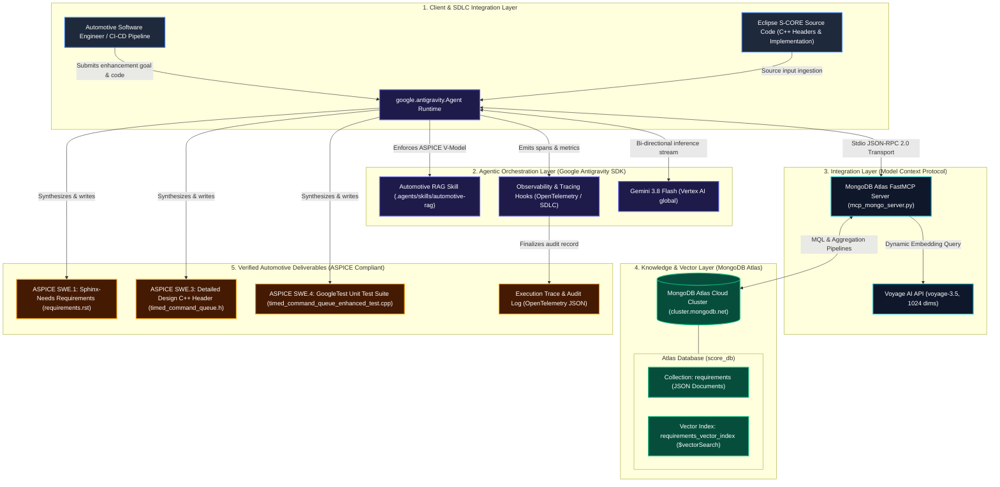

# High-Level Architecture: Automotive Agentic RAG with MongoDB Atlas

This document outlines the end-to-end architecture of the Automotive Agentic Spec-to-Code Platform, combining **Google Antigravity (AGY) SDK**, **Gemini 3.8 Flash** on Google Cloud Vertex AI, and **MongoDB Atlas** as the unified Vector and Knowledge Database.

---

## 1. Architectural Diagram

---

## 2. Core Architectural Layers

### Layer 1: Client and SDLC Layer
- **Input Artifacts**: Real production automotive source code (such as Eclipse S-CORE communication modules) paired with functional safety targets.
- **Workflow Triggers**: Triggered either on-demand by software engineers or automatically within the Horizon SDLC CI/CD pipeline (Jenkins, Argo CD, Cloud Build).

### Layer 2: Agentic Orchestration Layer (Google Antigravity SDK)
- **Autonomous Reasoning**: Uses `google.antigravity.Agent` running with autonomous capabilities (`capabilities=types.CapabilitiesConfig(agent_behavior=types.AgentBehavior.AUTONOMOUS)`).
- **Foundation Model**: Google Gemini 3.8 Flash via Vertex AI on the `global` endpoint, providing high reasoning throughput, sub-second token latency, and a 1M+ token context window.
- **Domain Skills**: Embedded skill system (`.agents/skills/automotive-rag`) providing specialized procedural knowledge:
  - Enforces ASPICE V-model stages (SWE.1 Requirements -> SWE.3 Detailed Design -> SWE.4 Unit Verification).
  - Enforces ISO 26262 ASIL-B fault mitigation (drop-oldest policies, bounded queues).
  - Enforces Eclipse S-CORE C++ guidelines (zero dynamic memory allocation in operational mode, `noexcept` specifications).
- **SDK Observability Hooks**: Intercepts every decision point via `@hooks.on_session_start`, `@hooks.pre_tool_call_decide`, and `@hooks.post_tool_call` to log execution traces.

### Layer 3: Integration Layer (Model Context Protocol - MCP)
- **FastMCP Stdio Transport**: Lightweight, process-isolated FastMCP server providing standardized tool discovery and execution over standard I/O (JSON-RPC 2.0).
- **Dynamic Vector Embeddings**: On each semantic search call, the server uses Voyage AI (`voyage-3.5`) to convert natural language queries into 1024-dimensional query vectors.
- **Exposed Primitives**:
  - `atlas_vector_search`: Direct vector similarity search using Atlas `$vectorSearch` with pre-filtering support.
  - `atlas_get_document`: Direct document lookup by `_id`.
  - `atlas_find`: Filtered MQL document queries.
  - `atlas_aggregate`: Full multi-stage aggregation pipeline execution.

### Layer 4: Data and Knowledge Layer (MongoDB Atlas)
- **Unified Store**: A single managed database (`score_db`) in MongoDB Atlas serving as both document store and vector database.
- **Index Configuration**:
  - Index Name: `requirements_vector_index`
  - Field: `embedding` (1024 dimensions, Cosine similarity)
  - Search Strategy: HNSW graph indexing for sub-10ms nearest-neighbor lookups.
- **Grounding Data**: Contains official ASPICE process standards, ISO 26262 failure modes, Eclipse S-CORE architectural guidelines, and Sphinx-Needs templates.

### Layer 5: Output and Verification Layer
- **ASPICE SWE.1 Software Requirements**: Emits structured Sphinx-Needs specifications (`requirements.rst`) with explicit IDs (`REQ_SCORE_TCQ_001` - `006`).
- **ASPICE SWE.3 Detailed Design**: Production C++ header (`timed_command_queue.h`) featuring compile-time bounded capacity, drop-oldest mitigation, overflow callbacks, and zero dynamic memory allocation.
- **ASPICE SWE.4 Unit Verification**: Compilable GoogleTest suite (`timed_command_queue_enhanced_test.cpp`) with explicit requirement traceability tags (`// Verifies: REQ_SCORE_TCQ_001`).
- **Audit & Governance Trace**: OpenTelemetry-compatible JSON trace containing exact timestamps, duration, token usage, tool invocations, and cost metrics.

---

## 3. End-to-End Sequence of Operations

```mermaid
sequenceDiagram
    autonumber
    actor Engineer as Automotive Engineer
    participant Agent as AGY SDK Agent (Gemini 3.8 Flash)
    participant MCP as FastMCP Server (mcp_mongo_server.py)
    participant Voyage as Voyage AI API (voyage-3.5)
    participant Atlas as MongoDB Atlas (score_db)
    participant Files as Output Workspace

    Engineer->>Agent: Request ASIL-B enhancement for timed_command_queue.h
    Agent->>Agent: Inspect input files & activate automotive-rag skill
    
    rect rgb(20, 30, 60)
        Note over Agent,Atlas: Phase 1: Knowledge Retrieval (Atlas Vector Search)
        Agent->>MCP: Call atlas_vector_search("queue overflow thread safety failure modes")
        MCP->>Voyage: Generate embedding (1024d)
        Voyage-->>MCP: Dense query vector
        MCP->>Atlas: Run $vectorSearch pipeline on requirements_vector_index
        Atlas-->>MCP: Top-K safety failure modes & mitigation documents
        MCP-->>Agent: Return grounded safety documents
    end

    rect rgb(30, 20, 50)
        Note over Agent,Files: Phase 2: Requirements & Architecture (SWE.1 & SWE.3)
        Agent->>Agent: Synthesize ASPICE SWE.1 Sphinx-Needs requirements (REQ_001..006)
        Agent->>Agent: Formulate zero-allocation C++ bounded queue header
        Agent->>Files: Write requirements.rst & timed_command_queue.h
    end

    rect rgb(20, 50, 40)
        Note over Agent,Files: Phase 3: Verification & Traceability (SWE.4)
        Agent->>Agent: Construct GoogleTest verification suite
        Agent->>Agent: Add explicit requirement trace tags (// Verifies: REQ_SCORE_TCQ_...)
        Agent->>Files: Write timed_command_queue_enhanced_test.cpp
        Agent->>Files: Write structured execution trace JSON
    end

    Agent-->>Engineer: Present summary, deliverables, and cost audit (< $0.01)
```

---

## 4. Key Architectural Strengths

1. **Direct Database Grounding (Zero Hallucinations)**:
   The agent queries real safety standards directly from MongoDB Atlas rather than relying on parametric memory, ensuring exact compliance with ASIL-B and Eclipse S-CORE conventions.
2. **Unified Protocol Integration**:
   The FastMCP server abstracts database mechanics into clean agent tools while allowing MongoDB Atlas to leverage its native `$vectorSearch` index.
3. **Automotive Traceability (V-Model Alignment)**:
   The architecture preserves 100% bi-directional traceability from customer requirements (SWE.1) to source code design (SWE.3) to test assertions (SWE.4).
4. **Extreme Cost Efficiency**:
   By pairing Gemini 3.8 Flash with high-precision vector retrieval, full end-to-end SDLC cycles cost **under $0.01 per run**.
